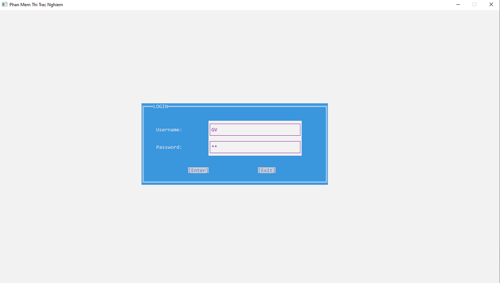
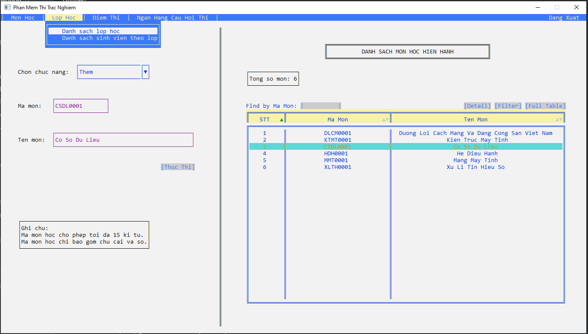
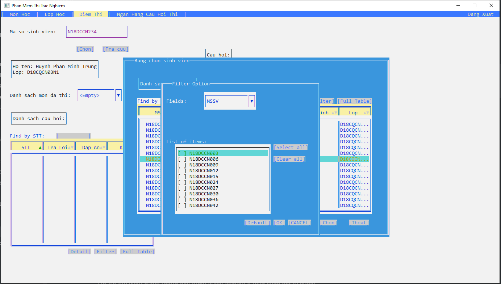
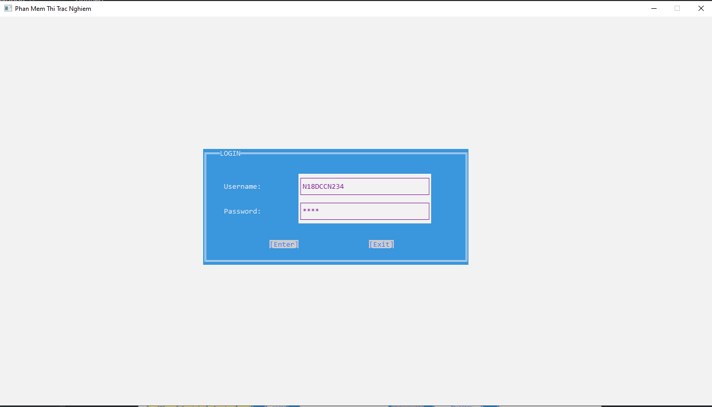
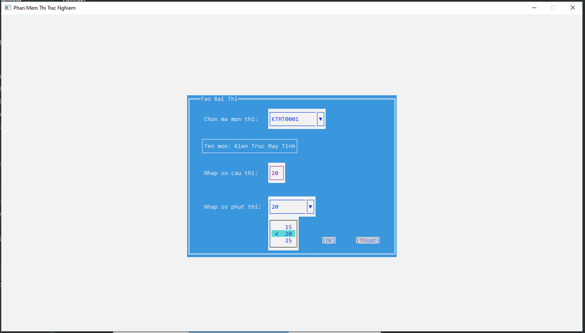
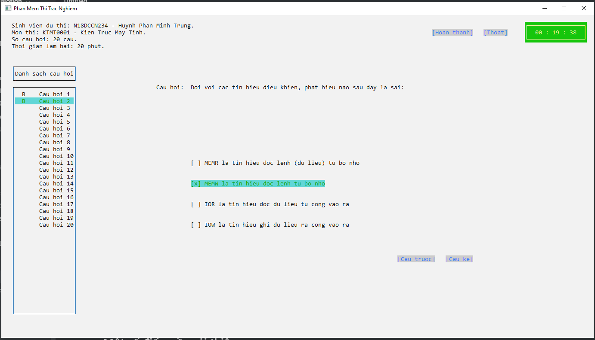

# Đồ Án Ứng Dụng Thi Trắc Nghiệm

Đồ án số 6 môn học Cấu trúc dữ liệu giải thuật năm học 2018.

## Mô tả chung

**Ta tổ chức các danh sách sau:**

- Danh sách môn học: mảng con trỏ (MAMH (C15), TENMH).
- Danh sách Lop : danh sách tuyến tính (MALOP, TENLOP, con trỏ): con trỏ sẻ trỏ đến danh sách sinh viên thuộc lớp đó.
- Danh sách sinh viên : danh sách liên kết đơn (MASV, HO, TEN, PHAI, password, con trỏ): con trỏ sẽ trỏ đến điểm các môn đã thi trắc nghiệm.
- Danh sách Điểm thi (danh sách liên kết đơn) (Mamh, Diem)
- Danh sách Câu hỏi thi (cây nhị phân tìm kiếm cân bằng với key = Id) (Id, Mă MH, Nội dung, A, B, C, D, Đáp án); trong đó A, B, C, D là 4 chọn lựa tương ứng với nội dung câu hỏi.

**Chương trình có các chức năng sau:**

- Đăng nhập dựa vào mã sinh viên, password. Nếu tài khoản đăng nhập là GV, pass là GV thì sẽ có toàn quyền .
- Nhập lớp
- In ds lớp
- Nhập sinh viên của lớp: nhập vào mã lớp trước, sau đó nhập các sinh viên vào lớp đó.
- Nhập môn học: cho phép cập nhật (thêm / xóa / hiệu chỉnh ) thông tin của môn học
- Nhập câu hỏi thi (Id là số ngẫu nhiên do chương trình tự tạo)
- Thi Trắc nghiệm ( trước khi thi hỏi người thi môn thi, số câu hỏi thi, số phút thi-sau đó lấy ngẫu nhiên các câu hỏi trong danh sách câu hỏi thi của môn.
- In chi tiết các câu hỏi đã thi 1 môn học của 1 sinh viên
- In bảng điểm thi trắc nghiệm môn học của 1 lớp (nếu có sinh viên chưa thi thì ghi “Chưa thi”.

**Lưu ý**: Chương trình cho phép lưu các danh sách vào file; Kiểm tra các điều kiện làm dữ liệu bị sai. Sinh viên có thể tự thiết kế thêm danh sách để đáp ứng yêu cầu của đề tài.

## Yêu cầu / Cài đặt

- Chương trình chỉ mới test trên Windows (ver. 7 or later).
- C++ Compatible: GNU C99 or newer version.
- Third-party library: None
- IDE used: [CodeBlock](https://www.codeblocks.org/)
- Cách build:

    Nhập command tại thư mục cần lưu (xem cách tải git cho Windows [tại đây](https://git-scm.com/downloads)):

    ```
    git clone https://github.com/MinhTrung2000/UngDungThiTracNghiem.git
    ```

    Giải nén và mở UngDungThiTracNghiem.cbp bằng CodeBlock.

- Chương trình hiển thị tốt ở độ phân giải màn hình 1902x1080 và cài đặt Font cho Window Command-line Prompt như mô tả:

## Một số đặc điểm

- Chương trình hỗ trợ sử dụng chuột (có thể cuộn) và keyboard để thao tác.
- Xây dựng các container Vector, List thay thế built-in vector, list trong C++.
- Cài đặt một số hàm utility chuẩn hóa dữ liệu nhập vào.
- Chương trình yêu cầu xác thực người dùng là giáo viên (đầy đủ quyền quản lý) và sinh viên (chỉ được dự thi).

    Tài khoản giáo viên mặc định là GV và password là GV.

    Tài khoản sinh viên xem tại file DSSV.data trong directory data/Lop/Dxxx.

    👉 Có thể demo bằng tài khoản sinh viên sau: (username: N18DCCN234, password: 8008)

- Sử dụng Timer trong lúc thí sinh thi trắc nghiệm.
- Xây dựng một số thành phần UI: Combo Box, Text Area, Button, Check List, Table, ...
- Xây dựng float menu bar.
- Table hỗ trợ sắp xếp từng field, lấy dữ liệu record (Detail button), lọc dữ liệu (Filter button) và xuất ra file .TXT (Fulltable button).

    Hỗ trợ tìm kiếm chuỗi (dùng giải thuật linear search) ở field chứa giá trị khóa.

- Text Field, Text Area hỗ trợ đầy đủ các phím BS, Del, Left, Right.

    Text box tự động xuống dòng nếu tràn chuỗi nhập vào.

- Hỗ trợ Tab khi nhập Input ở các thành phần UI.
- Hỗ trợ hiển thị nhiều tầng panel và get back (xem ảnh mô tả ở dưới).
- Thông báo điểm số sau khi thí sinh thi trắc nghiệm.

## Một số hình ảnh

1. Giáo viên login

    

    Xây dựng thanh menu.

    

    Hỗ trợ hiển thị nhiều lớp panel và get back.

    

1. Sinh viên login

    

    

    

## Một số điểm cần cải thiện

- Cơ chế quản lý file chưa hiệu quả.
- Chưa hỗ trợ tiếng việt, utf8 encoding.
- Chỉ hỗ trợ Linear Search, chưa hỗ trợ Fuzzy Search tại Table.
- Cần cải thiện cách design sao cho chương trình chạy mượt hơn.
- Một số big bug chưa fix.

## Tham khảo

Window Console API Reference: [Link](https://docs.microsoft.com/en-us/windows/console/console-reference)